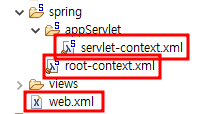
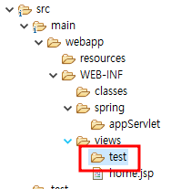
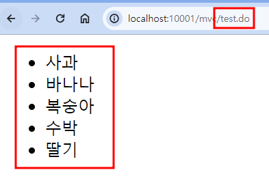
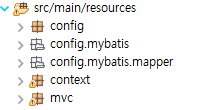
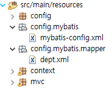

# MVC 패턴에 대해서 자세히 알아보자
- 스프링의 구조에 대해서 총 정리하는 시간

## Ex_날짜_SpringMVC
- com.korea.mvc


프로젝트의 마지막 계층은 구별을 해주는 식별자의 역할도 한다.

## pom.xml, config패키지 복사해서 넣기


- 이외의 xml파일은 제거하기



## ServletContext의 역할
- 컨트롤러 객체 생성하기
- /WEB-INF/views/ 경로안에 jsp파일을 만든다면 .jsp를 안붙혀도 되게 해준다.
- 이미지,JS파일,CSS파일과 같은 참조 파일들은 webapp/resources폴더에 넣어놓고 사용을 할것이다.<br>(resources가 하나 더있으니 헷갈리지 말것)
```java
@Configuration
@EnableWebMvc
//@ComponentScan("com.korea.test") 자동탐색
//어노테이션에도 상속관계가 있다
/*
 *@Component
 *	ㄴ@Controller
 *	ㄴ@Service
 *	ㄴ@Repository 
 * */
//컴포넌트의 자식객체가 들어있으면 사실 Controller가 아니어도 만들어 질 수 있다.
public class ServletContext implements WebMvcConfigurer {

	@Override
	public void addResourceHandlers(ResourceHandlerRegistry registry) {
		registry.addResourceHandler("/resources/**").addResourceLocations("/resources/");
	}

	@Bean
	public InternalResourceViewResolver resolver() {
		InternalResourceViewResolver resolver = new InternalResourceViewResolver();
		resolver.setViewClass(JstlView.class);
		resolver.setPrefix("/WEB-INF/views/");
		resolver.setSuffix(".jsp");
		return resolver;
	}
	

}

```

## com.korea.mvc에 TestController 클래스 생성하기
```java
package com.korea.mvc;

import org.springframework.stereotype.Controller;
import org.springframework.web.bind.annotation.RequestMapping;

@Controller
public class TestController {

	public TestController() {
		System.out.println("----TestController의 생성자 호출---");
	}
	
	@RequestMapping("/test.do") //내가 url에 test.do를 호출하면
	public String test() { //test()메서드가 실행이 된다.
		return "test"; //WEB-INF/views/에 있는 test.jsp좀 실행해줘라 여기서 문제가 좀 발생한다
	}
  
  1,2,3.jsp는 사원 폴더에 저장하고 싶고
  4,5,6.jsp는 고객 폴더에 넣어서 관리하고 싶을 수 있다.
  ServletContext를 조금 수정해줘야 한다.
  
}

```

실행하면 콘솔에 출력이 잘되는걸 확인할 수 있다.


## ServletContex 수정하기
```java
package config;

import org.springframework.context.annotation.Bean;
import org.springframework.context.annotation.ComponentScan;
import org.springframework.context.annotation.Configuration;
import org.springframework.web.servlet.config.annotation.EnableWebMvc;
import org.springframework.web.servlet.config.annotation.ResourceHandlerRegistry;
import org.springframework.web.servlet.config.annotation.WebMvcConfigurer;
import org.springframework.web.servlet.view.InternalResourceViewResolver;
import org.springframework.web.servlet.view.JstlView;


@Configuration
@EnableWebMvc
@ComponentScan("com.korea.mvc")
//어노테이션에도 상속관계가 있다
/*
 *@Component
 *	ㄴ@Controller
 *	ㄴ@Service
 *	ㄴ@Repository 
 * */
//컴포넌트의 자식객체가 들어있으면 사실 Controller가 아니어도 만들어 질 수 있다.
public class ServletContext implements WebMvcConfigurer {

	@Override
	public void addResourceHandlers(ResourceHandlerRegistry registry) {
		registry.addResourceHandler("/resources/**").addResourceLocations("/resources/");
	}

	/*
	 * @Bean public InternalResourceViewResolver resolver() {
	 * InternalResourceViewResolver resolver = new InternalResourceViewResolver();
	 * resolver.setViewClass(JstlView.class); resolver.setPrefix("/WEB-INF/views/");
	 * resolver.setSuffix(".jsp"); return resolver; }
	 */
}

```
## views폴더 안에 test 폴더 만들기

### 앞으로 현재 컨트롤러가 실행할 jsp의 경로를 지정
```java
package com.korea.mvc;

import org.springframework.stereotype.Controller;
import org.springframework.web.bind.annotation.RequestMapping;

@Controller
public class TestController {
	///////////////////////////////////////////////////////////////////////
	public static final String VIEW_PATH = "/WEB-INF/views/test/";
	///////////////////////////////////////////////////////////////////////

	public TestController() {
		System.out.println("----TestController의 생성자 호출---");
	}

	///////////////////////////////////////////////////////////////////////
	@RequestMapping("/test.do") //내가 url에 test.do를 호출하면
	public String test() { //test()메서드가 실행이 된다.
		return VIEW_PATH + "test.jsp"; //WEB-INF/views/에 있는 test.jsp좀 실행해줘라
	}
	///////////////////////////////////////////////////////////////////////
}

```
### test폴더안에 test.jsp 만들기

```java
<%@ page language="java" contentType="text/html; charset=UTF-8"
    pageEncoding="UTF-8"%>
<!DOCTYPE html>
<html>
<head>
<meta charset="UTF-8">
<title>Insert title here</title>
</head>
<body>
	안녕하세요
</body>
</html>
```

### util패키지에 MyPath클래스만들기

```java
package util;

public class MyPath {

	public static class TestClass{
		
		public static final String VIEW_PATH = "/WEB-INF/views/test/";
	}
	
	public static class HomeClass{
		
		public static final String VIEW_PATH = "/WEB-INF/views/";
	}
}

```

### TestController에서 임의의 배열을 바인딩하여 포워딩까지 해보자.
```java
package com.korea.mvc;

import org.springframework.stereotype.Controller;
import org.springframework.ui.Model;
import org.springframework.web.bind.annotation.RequestMapping;

@Controller
public class TestController {
	
	public static final String VIEW_PATH = "/WEB-INF/views/test/";

	public TestController() {
		System.out.println("----TestController의 생성자 호출---");
	}
	
	@RequestMapping("/test.do") //내가 url에 test.do를 호출하면
	public String test(Model model) { //test()메서드가 실행이 된다.
		
		String[] msg = {"사과","바나나","복숭아","수박","딸기"};
		
		model.addAttribute("msg",msg);//바인딩
		
		return VIEW_PATH + "test.jsp"; //WEB-INF/views/에 있는 test.jsp좀 실행해줘라
		//포워딩
	}
}

```

### 과일목록 출력하기
```java
<%@ page language="java" contentType="text/html; charset=UTF-8"
    pageEncoding="UTF-8"%>
<%@ taglib prefix="c" uri="http://java.sun.com/jsp/jstl/core" %>
<!DOCTYPE html>
<html>
<head>
<meta charset="UTF-8">
<title>Insert title here</title>
</head>
<body>
	<ul>
	<c:forEach var="vo" items="${msg}">
		<li>${vo}</li>
	</c:forEach>
	
	</ul>
</body>
</html>
```



### ip를 받아오려면 어쩔수 없이 request 객체가 필요하다.
```java
	@RequestMapping("/test.do") //내가 url에 test.do를 호출하면
	public String test(Model model, HttpServletRequest request) { //test()메서드가 실행이 된다.
		
		String[] msg = {"사과","바나나","복숭아","수박","딸기"};
		String ip = request.getRemoteAddr();
		model.addAttribute("msg",msg);//바인딩
		model.addAttribute("ip",ip);
		
		return VIEW_PATH + "test.jsp"; //WEB-INF/views/에 있는 test.jsp좀 실행해줘라
		//포워딩
	}
}
```
### test.jsp에서 ip 출력하기
```java
<%@ page language="java" contentType="text/html; charset=UTF-8"
    pageEncoding="UTF-8"%>
<%@ taglib prefix="c" uri="http://java.sun.com/jsp/jstl/core" %>
<!DOCTYPE html>
<html>
<head>
<meta charset="UTF-8">
<title>Insert title here</title>
</head>
<body>
	${ip}
	<ul>
	<c:forEach var="vo" items="${msg}">
		<li>${vo}</li>
	</c:forEach>
	
	</ul>
</body>
</html>
```

# 파라미터 넘기기

## Ex_날짜_SpringParam
- com.korea.param
- pom.xml,config패키지 복사해오기
- 나머지 xml 삭제하기
- util패키지 복사해오기

## vo 패키지에 PersonVO 클래스 만들기
```java
package vo;

@Getter
@Setter
public class PersonVO {
	private String name, tel;
	private int age;	
	
}

```
## views 폴더에 insert_form.jsp 만들기
```java
<%@ page language="java" contentType="text/html; charset=UTF-8"
    pageEncoding="UTF-8"%>
<!DOCTYPE html>
<html>
<head>
<meta charset="UTF-8">
<title>Insert title here</title>
</head>
<body>
	hello
</body>
</html>
```

## com.korea.param 패키지에 ParamController.java 만들기
```java
@Controller
public class ParamController {
	value라고 하는 속성은 배열 형식으로 여러 가지 매핑을 줄 수 있다.
	바인딩을 할게 없으면 return을 써서 바로 포워딩을 해주면 된다.
	@RequestMapping(value= {"/","/insert_form.do"}) 가장 첫페이지 정도만 두개를 갖는다.
	public String insert_form() {
		return MyPath.PATH + "insert_form.jsp";
	}
}
```

## insert_form.jsp에 코드 추가하기
```java
<%@ page language="java" contentType="text/html; charset=UTF-8"
    pageEncoding="UTF-8"%>
<!DOCTYPE html>
<html>
<head>
<meta charset="UTF-8">
<title>Insert title here</title>
<script>
	function send1(f){
		var name = f.name.value;
		var age = f.age.value;
		var tel = f.tel.value;
		
		if(name == ''){
			alert("이름을 입력해주세요");
			return;
		}
		
		f.action = "insert1.do";
		f.method = "post";
		f.submit();
	}
	
	function send2(f){
		var name = f.name.value;
		var age = f.age.value;
		var tel = f.tel.value;
		
		f.action = "insert2.do";
		f.method = "post";
		f.submit();
	}
</script>
</head>
<body>
	<form>
	<table border="1" align="center">
		<caption>:::개인정보 입력:::</caption>
		<tr>
		<th>이름</th>
		<td><input name="name"></td>
		</tr>
		
		<tr>
		<th>나이</th>
		<td><input name="age"></td>
		</tr>
		
		<tr>
		<th>전화번호</th>
		<td><input name="tel"></td>
		</tr>
		
		<tr>
			<td colspan="2" align="center">
				<input type="button" value="낱개로 받기"
							onclick="send1(this.form);">
				<input type="button" value="객체로 받기"
							onclick="send2(this.form);">
		</tr>
	</table>
	</form>
</body>
</html>
```

## ParamController.java에서 매핑 잡아주기
```java
package com.korea.param;

import java.io.UnsupportedEncodingException;

import javax.servlet.http.HttpServletRequest;

import org.springframework.stereotype.Controller;
import org.springframework.ui.Model;
import org.springframework.web.bind.annotation.RequestMapping;

import util.MyPath;
import vo.PersonVO;

@Controller
public class ParamController {
	
	//value라고 하는 속성은 배열 형식으로 여러가지 매핑을 줄 수 있다.
	@RequestMapping(value= {"/","/insert_form.do"})
	public String insert() {
		return MyPath.PATH + "insert_form.jsp";
	}
	
	@RequestMapping("/insert1.do")//name=홍길동&age=100&tel=010111111111
	public String insert1(Model model, String name, int age, String tel) {
		
		jsp에서는 서블릿에서 파라미터를 받을 때 request객체를 이용하여 받았지만
		스프링에서는 넘어오는 파라미터하고 메서드에서 받아주는 파라미터의 이름이 같다면
		그냥 받아줄 수 있다.

		정수는 정수로 들어와서 Integer.parseInt가 필요 없다.
		
		원래 post로 한글을 작성하면 깨진다. 그래서 request객체를 이용해서 setCharacterEncoding을 해줬는데
		스프링에서는 해줘도 깨진다. 그래서 우리가 Filter를 추가해준것.
		
		PersonVO vo = new PersonVO();
		vo.setName(name);
		vo.setAge(age);
		vo.setTel(tel);
		
		model.addAttribute("vo",vo);
		return MyPath.PATH + "insert_result.jsp";
	}
	
	@RequestMapping("/insert2.do")
	public String insert2(Model model, PersonVO vo) {
		//파라미터로 넘어온 name,age,tel을 vo 객체에 자동으로 setting을 해준다.
		//vo에 있는 이름이 있다면 따로 받는 파라미터에 같은 이름이 있으면 오류가 난다.
		
		현재 PersonVO에 변수가 세 개 있는데 파라미터를 두개(name과 age)만 던지면 tel는 자동으로 null값이 들어간다.
		하지만 PersonVO에 있는 변수보다 많은 개수의 파라미터를 던지게 되면 문제가 된다.
		model.addAttribute("vo",vo);
		return MyPath.PATH + "insert_result.jsp";
	}
}

```


## views폴더에 insert_result.jsp 만들기
```java
<%@ page language="java" contentType="text/html; charset=UTF-8" pageEncoding="UTF-8"%>
<!DOCTYPE html>
<html>
<head>
<meta charset="UTF-8">
<title>Insert title here</title>
</head>
<body>
	<p>이름: ${vo.name}</p>
	<p>나이: ${vo.age}</p>
	<p>전화번호: ${vo.tel}</p>
	
	<input type="button" value="돌아가기" 
	 onclick="location.href='insert_form.do'">
	 <!-- 스프링에서는 jsp에서 jsp로 화면전환이 불가능 하므로 반드시
	 컨트롤러를 거쳐서 jsp로 전환을 해줘야 한다.  -->
</body>
</html>
```

# Mybatis연동하기

## Ex_날짜_DB
- com.korea.db
- pom.xml, config패키지 복사해오기

### mybatis연결을 위한 파일 스터디룸에서 다운받기
- db연결하는 객체, dao관련 객체를 나눠서 만들어보자



### WebInitializer 코드 수정하기
- RootContext이름을 f2를 눌러 수정하여 만들어주자.

```java
package config;

import mvc.ServletContext;

public class WebInitializer extends AbstractAnnotationConfigDispatcherServletInitializer {

	// Root WebApplicationContext
	@Override
	protected Class<?>[] getRootConfigClasses() {
		return new Class[] { Context_1_dataSource.class,Context_2_mybatis.class,Context_3_dao.class };
	}

	// Servlet WebApplicationContext
	@Override
	protected Class<?>[] getServletConfigClasses() {
		return new Class[] { ServletContext.class };
	}
	
    // DispatcherServlet Mapping
	@Override
	protected String[] getServletMappings() {
		return new String[] { "/" };
	}

	// filter
	@Override
    protected Filter[] getServletFilters() {
        CharacterEncodingFilter characterEncodingFilter = new CharacterEncodingFilter();
        characterEncodingFilter.setEncoding("UTF-8");
        characterEncodingFilter.setForceEncoding(true);
        return new Filter[] { characterEncodingFilter };
    }
}

```

### 새로 추가하려는 기능이 있다면 context파일을 새로만들어주면 된다.

- ojdbc6.jar 찾아서 톰캣의 lib폴더에 넣기


### mybatis와 관련된 파일 집어넣기



### DB연결을 위한 라이브러리를 Pom.xml에 등록을 해보자.
- java에서 호환되는것과 Spring에서 호환되는것을 다운받아야 한다.

1. dbcp


1.4 버전

```xml
<!-- https://mvnrepository.com/artifact/commons-dbcp/commons-dbcp -->
<dependency>
    <groupId>commons-dbcp</groupId>
    <artifactId>commons-dbcp</artifactId>
    <version>1.4</version>
</dependency>
```

### Context_1_dataSource.java 코드 추가하기
```java
package context;

import javax.sql.DataSource;

import org.apache.commons.dbcp.BasicDataSource;
import org.springframework.context.annotation.Bean;
import org.springframework.context.annotation.Configuration;
import org.springframework.context.annotation.PropertySource;

@Configuration
public class Context_1_datasource {
	
	@Bean 
	public DataSource ds(){
		BasicDataSource ds = new BasicDataSource();
		ds.setDriverClassName("oracle.jdbc.OracleDriver");
		ds.setUrl("jdbc:oracle:thin:@localhost:1521:xe");
		ds.setUsername("test_pm");
		ds.setPassword("1111");
		return ds;
	}
}

```

2. mybatis


```xml
<!-- https://mvnrepository.com/artifact/org.mybatis/mybatis -->
<dependency>
    <groupId>org.mybatis</groupId>
    <artifactId>mybatis</artifactId>
    <version>3.5.6</version>
</dependency>

```


```xml
<!-- https://mvnrepository.com/artifact/org.mybatis/mybatis-spring -->
<dependency>
    <groupId>org.mybatis</groupId>
    <artifactId>mybatis-spring</artifactId>
    <version>1.3.1</version>
</dependency>

```

3. spring jdbc


```
<!-- https://mvnrepository.com/artifact/org.springframework/spring-jdbc -->
<dependency>
    <groupId>org.springframework</groupId>
    <artifactId>spring-jdbc</artifactId>
    <version>3.2.2.RELEASE</version>
</dependency>

```

### Context_2_mybatis.java
```
package context;

import javax.sql.DataSource;

import org.apache.ibatis.session.SqlSessionFactory;
import org.mybatis.spring.SqlSessionFactoryBean;
import org.mybatis.spring.SqlSessionTemplate;
import org.springframework.context.annotation.Bean;
import org.springframework.context.annotation.Configuration;
import org.springframework.core.io.ClassPathResource;
import org.springframework.core.io.Resource;


@Configuration
public class Context_2_mybatis {
	
	
	DataSource ds;
	
	//생성자 주입
	public Context_2_mybatis(DataSource ds) {
		this.ds = ds;
	}
	
	@Bean
	public SqlSessionFactory factoryBean() throws Exception {
		SqlSessionFactoryBean factoryBean = new SqlSessionFactoryBean();
		factoryBean.setDataSource(ds);
		
		// 추가적인 MyBatis 설정
        factoryBean.setConfigLocation(new ClassPathResource("config/mybatis/mybatis-config.xml"));
        return factoryBean.getObject();
  
	}
	
	@Bean
	//함수의 파라미터로 호출하면 기본적으로 생성자 주입으로 주입이 된다.
	public SqlSessionTemplate sqlSessionBean(SqlSessionFactory factoryBean) {
		return new SqlSessionTemplate(factoryBean);
	}
}

```

## dao패키지에 DeptDAO.java 만들기

```
package dao;

import java.util.List;

import org.apache.ibatis.session.SqlSession;

import vo.DeptVO;

public class DeptDAO {

	SqlSession sqlSession;
	
	public void setSqlSession(SqlSession sqlSession) {
		this.sqlSession = sqlSession;
	}
	
	//전체 부서 조회
	public List<DeptVO> selectList(){
		List<DeptVO> list = sqlSession.selectList("dept.dept_list");
		return list;
	}
}

```

## Context_3_dao에서 객체 생성하기
```
package context;

import java.sql.Connection;

import org.apache.ibatis.session.ExecutorType;
import org.apache.ibatis.session.SqlSession;
import org.apache.ibatis.session.SqlSessionFactory;
import org.apache.ibatis.session.TransactionIsolationLevel;
import org.mybatis.spring.SqlSessionTemplate;
import org.springframework.context.annotation.Bean;
import org.springframework.context.annotation.Configuration;

import dao.DeptDAO;
//setter로 sqlSession을 주입받았으니...

@Configuration
public class Context_3_dao {

	@Bean
	public DeptDAO dept_dao(SqlSession sqlSession) {
		DeptDAO dept_dao = new DeptDAO();
		dept_dao.setSqlSession(sqlSession);
		return dept_dao;
	}
}
```

## dept.xml 쿼리문 생성하기
```
<?xml version="1.0" encoding="UTF-8" ?>
<!DOCTYPE mapper
PUBLIC "-//mybatis.org//DTD Mapper 3.0//EN"
"http://mybatis.org/dtd/mybatis-3-mapper.dtd">
<mapper namespace="dept">

	<select id="dept_list" resultType="vo.DeptVO">
		select * from dept
	</select>
</mapper>

```

## com.korea.db 패키지에 DeptController 클래스 만들기
```
package com.korea.db;

import java.util.List;

import org.springframework.stereotype.Controller;
import org.springframework.ui.Model;
import org.springframework.web.bind.annotation.RequestMapping;

import dao.DeptDAO;
import vo.DeptVO;

@Controller
public class DeptController {

	public static final String VIEW_PATH = "/WEB-INF/views/dept/";
	
	//dao에 대한 정보가 필요하기 때문에 이미 만들어놓은 정보를 주입해야 한다.
	DeptDAO dept_dao;
	
	public DeptController(DeptDAO dept_dao) {
		this.dept_dao = dept_dao;
	}
	
	@RequestMapping(value= {"/","list.do"})
	public String list(Model model) {
		List<DeptVO> list = dept_dao.selectList();
		
		model.addAttribute("list",list);
		return VIEW_PATH + "dept_list.jsp";
	}
}

```

## mvc 패키지에 DeptController 객체 생성하기
```
package mvc;

import org.springframework.context.annotation.Bean;
import org.springframework.context.annotation.ComponentScan;
import org.springframework.context.annotation.Configuration;
import org.springframework.web.servlet.config.annotation.EnableWebMvc;
import org.springframework.web.servlet.config.annotation.ResourceHandlerRegistry;
import org.springframework.web.servlet.config.annotation.WebMvcConfigurer;
import org.springframework.web.servlet.view.InternalResourceViewResolver;
import org.springframework.web.servlet.view.JstlView;

import com.korea.db.DeptController;

import dao.DeptDAO;


@Configuration
@EnableWebMvc
//@ComponentScan("com.korea.db")
//어노테이션에도 상속관계가 있다
/*
 *@Component
 *	ㄴ@Controller
 *	ㄴ@Service
 *	ㄴ@Repository 
 * */
//컴포넌트의 자식객체가 들어있으면 사실 Controller가 아니어도 만들어 질 수 있다.
public class ServletContext implements WebMvcConfigurer {

	@Override
	public void addResourceHandlers(ResourceHandlerRegistry registry) {
		registry.addResourceHandler("/resources/**").addResourceLocations("/resources/");
	}

	
//	  @Bean 
//	  public InternalResourceViewResolver resolver() {
//	  InternalResourceViewResolver resolver = new InternalResourceViewResolver();
//	  resolver.setViewClass(JstlView.class); resolver.setPrefix("/WEB-INF/views/");
//	  resolver.setSuffix(".jsp"); return resolver; }
	
	@Bean
	public DeptController deptController(DeptDAO dept_dao) {
		return new DeptController(dept_dao);
	}
}

```
## dept폴더에 dept_list.jsp 생성하기


```
<%@ page language="java" contentType="text/html; charset=UTF-8"
    pageEncoding="UTF-8"%>
<%@taglib prefix="c" uri="http://java.sun.com/jsp/jstl/core" %>
<!DOCTYPE html>
<html>
<head>
<meta charset="UTF-8">
<title>Insert title here</title>
</head>
<body>
	안녕하세요
	<table border = "1" align="center">
		<tr>
			<th>부서번호</th>
			<th>부서명</th>
			<th>부서위치</th>
		</tr>
		<c:forEach var="i" items="${list}">
		<tr>
			<td>${i.deptno }</td>
			<td>${i.dname }</td> 
			<td>${i.loc }</td>
		</tr>
		</c:forEach>
	</table>
</body>
</html>
```


# 실습 : 고객,사원테이블 조회해보기

## Ex_날짜_DB 프로젝트 생성하기
1. pom.xml 복사하기
	- Artifact Id, Name은 바꿔주는것이 좋다(오류날 수 있는 변수를 최대한 줄이자)


2. resources에 있는 패키지 가져오기<br>


3. web.xml,root-context.xml,servlet-context.xml 삭제하기

4. 이름 바꾸기
	1. mapper 이름 바꾸기(mybatis-config.xml에서 이름 참조하기)

5. Context_3_dao.java의 내용 내가 생성할 DAO코드로 변경

6. ServletContext.java도 우리가 생성할 컨트롤러의 내용으로 변경

* * *

1. VO 생성하기
2. DAO클래스 만들고 Context_3_dao.java에 DAO빈 생성
3. 2에서 만든 bean객체에 context_2_mybatis.java에서 생성한 sqlSessionBean을 참조시키자
4. 컨트롤러를 생성하고 DAO객체를 setter & 생성자 주입으로 받아준다.
5. ServletContext.java에서 4에서 준비한 dao를 참조
6. DAO에서 mapper접근
7. 컨트롤러에서 url 매핑 지정 후 DAO의 메서드 호출
8. 컨트롤러에서 DB를 거쳐 포워딩 된 정보를 jsp에서 호출

### 사원테이블을 조회하여 사번, 이름, 부서번호, 급여를 테이블로 출력

## vo 패키지에 SawonVO 클래스 만들기
```java
package vo;

import lombok.Getter;
import lombok.Setter;

@Setter
@Getter
public class SawonVO {

	private int sabun,deptno,sapay;
	private String saname;
}

```

## dao 패키지에 SawonDAO 클래스 만들기
```java
package dao;

import org.apache.ibatis.session.SqlSession;

public class SawonDAO {

	SqlSession sqlSession;
	
	public SawonDAO(SqlSession sqlSession) {
		this.sqlSession = sqlSession;
	}
	
	
}

```

## Context_3_dao클래스에 dao 객체 만들기
```java
package context;

import org.apache.ibatis.session.SqlSession;
import org.springframework.context.annotation.Bean;
import org.springframework.context.annotation.Configuration;

import dao.SawonDAO;

@Configuration
public class Context_3_dao {
	
	SqlSession sqlSession;
	
	public Context_3_dao(SqlSession sqlSession) {
		this.sqlSession = sqlSession;
	}

	@Bean
	public SawonDAO sawon_dao() {
		return new SawonDAO(sqlSession);
	}

}
```

## controller 패키지에 SawonController클래스 생성하기
```java
package controller;

import org.springframework.stereotype.Controller;

import dao.SawonDAO;

@Controller
public class SawonController {
	
	SawonDAO sawon_dao;
	
	public void setSawon_dao(SawonDAO sawon_dao) {
		this.sawon_dao = sawon_dao;
	}
}
```

## ServletContext클래스에 SawonController객체 만들기
```
package mvc;

import org.springframework.context.annotation.Bean;
import org.springframework.context.annotation.Configuration;
import org.springframework.web.servlet.config.annotation.EnableWebMvc;
import org.springframework.web.servlet.config.annotation.ResourceHandlerRegistry;
import org.springframework.web.servlet.config.annotation.WebMvcConfigurer;

import controller.SawonController;
import dao.SawonDAO;


@Configuration
@EnableWebMvc
//@ComponentScan("com.korea.db")
//어노테이션에도 상속관계가 있다
/*
 *@Component
 *	ㄴ@Controller
 *	ㄴ@Service
 *	ㄴ@Repository 
 * */
//컴포넌트의 자식객체가 들어있으면 사실 Controller가 아니어도 만들어 질 수 있다.
public class ServletContext implements WebMvcConfigurer {

	@Override
	public void addResourceHandlers(ResourceHandlerRegistry registry) {
		registry.addResourceHandler("/resources/**").addResourceLocations("/resources/");
	}

	
//	  @Bean 
//	  public InternalResourceViewResolver resolver() {
//	  InternalResourceViewResolver resolver = new InternalResourceViewResolver();
//	  resolver.setViewClass(JstlView.class); resolver.setPrefix("/WEB-INF/views/");
//	  resolver.setSuffix(".jsp"); return resolver; }
	
	@Bean
	public SawonController sawonController(SawonDAO sawon_dao) {
		SawonController sawonController = new SawonController();
		sawonController.setSawon_dao(sawon_dao);
		return sawonController;
	}
	 
}

```

## dao클래스에서 테이블 조회 코드 작성하기
```
//사원테이블 조회
public List<SawonVO> selectList(){
	List<SawonVO> list = sqlSession.selectList("s.sawon_list");
	return list;
}
```

## sawon.xml에 쿼리문 작성하기
```
<?xml version="1.0" encoding="UTF-8" ?>
<!DOCTYPE mapper
PUBLIC "-//mybatis.org//DTD Mapper 3.0//EN"
"http://mybatis.org/dtd/mybatis-3-mapper.dtd">
<mapper namespace="s">

	<select id="sawon_list" resultType="sawon">
		select * from sawon
	</select>
</mapper>
```

## SawonController에서 리스트 받기
```java
package controller;

import java.util.List;

import org.springframework.stereotype.Controller;
import org.springframework.ui.Model;
import org.springframework.web.bind.annotation.RequestMapping;

import dao.SawonDAO;
import vo.SawonVO;

@Controller
public class SawonController {
	
	SawonDAO sawon_dao;
	
	public void setSawon_dao(SawonDAO sawon_dao) {
		this.sawon_dao = sawon_dao;
	}
	
	@RequestMapping(value= {"/","sawon_list.do"})
	public String list(Model model) {
		
		List<SawonVO> list = sawon_dao.selectList();
		
		model.addAttribute("list",list);
		return "/WEB-INF/views/sawon/sawon.jsp";
	}
}

```

## /WEB-INF/views/sawon/위치에 sawon.jsp만들기
```
<%@ page language="java" contentType="text/html; charset=UTF-8"
    pageEncoding="UTF-8"%>
    
<%@ taglib prefix="c" uri="http://java.sun.com/jsp/jstl/core" %>
<!DOCTYPE html>
<html>
<head>
<meta charset="UTF-8">
<title>Insert title here</title>
</head>
<body>
	<table border="1">
	<tr>
		<th>사번</th>
		<th>이름</th>
		<th>부서번호</th>
		<th>급여</th>
	</tr>
	<c:forEach var="vo" items="${list}">
		<tr>
			<td>${vo.sabun }</td>
			<td>${vo.saname }</td>
			<td>${vo.deptno }</td>
			<td>${vo.sapay }</td>
		</tr>
	</c:forEach>
	</table>
</body>
</html>
```


