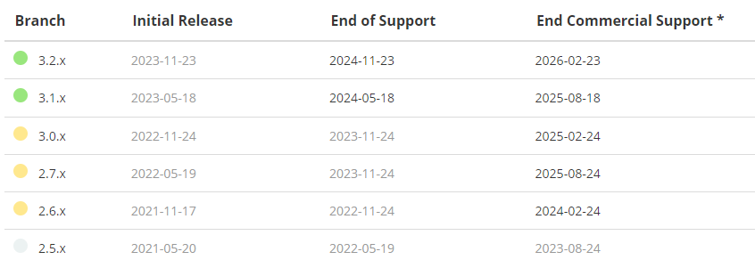
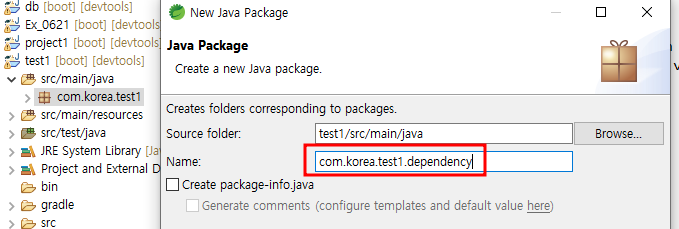
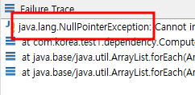

# Spring Boot 2.x 지원 종료
- Spring Boot가 11월말부터 2.x 버전의 지원을 종료선언함


<hr>

# 스프링 부트(Spring boot)
- 스프링은 기존 기술의 복잡성을 크게 줄인 프레임워크이지만, 그럼에도 불구하고 스프링을 사용하기 위해서는 여러가지 사항들을 설정해줘야 한다.

- 하지만 스프링부트를 사용하면 복잡한 설정 정보를 간략하게 줄일 수 있다.

- 스프링 부트는 스프링으로 애플리케이션을 만들 때에 필요한 설정들을 간편하게 처리해주는 별도의 프레임워크이다.

- 톰캣과 같은 웹 애플리케이션(WAS)가 자체 내장되어 있다.
  - 기존에 배포를 할 때는 별도의 외장 웹 서버를 설치하고 프로젝트를 War파일로 빌드하여 배포를 진행했는데, 이러한 방식은 번거롭다는 단점을 가진다. 반면 스프링 부트는 자체적인 웹서버를 내장하고 있어, 빠르고 간편하게 배포를 진행할 수 있습니다.
  - 또한 스프링 부트를 사용하면 독립적으로 실행 가능한 Jar파일로 프로젝트를 빌드할 수 있어, 클라우드 서비스 및 도커와 같은 가상화 환경에 빠르게 배포할 수 있습니다.
  
- 빌드 구성을 단순화 하기 위한 Spring Boot Starter 제공
  - 스프링 부트에서 스타터(stater) 설정을 자동화해주는 모듈을 의미합니다. 
	- 프로젝트에서 설정해야 하는 다양한 의존성을 사전에 미리 정의해서 제공합니다. 
	- 프로젝트에서 설정해야 하는 다수의 의존성들을 스타터가 이미 포함하고 있기 때문에 스타터에 대한 의존성만 추가하면 프로젝트를 쉽게진행할 수 있습니다.
	
- XML 설정 없이 단순 자바 수준의 설정 방식 제공
	- 스프링 부트는 XML에 설정을 작성할 필요 없이 자바 코드로 설정할 수 있습니다. 
	- XML은 문법이틀리거나 선언이 선언을 잘못하면 원인을 찾기 힘듭니다. 
	- 자바 코드는 컴파일러의 도움을 받기 때문에 오타 등의 설정 정보 오류를 미리 알 수 있습니다. 
	- 또한 클래스 단위로 설정하기 때문에 쉽게 관리할 수 있습니다.

## 자바 설치하기
- [JDK다운로드](https://www.oracle.com/java/technologies/downloads)

## STS(Spring Tool Suite)

- STS(Spring Tool Suite)는 이클립스기반의 스프링에 최적화된 IDE입니다.

- [다운로드](https://spring.io/tools)

- 다운로드된 jar파일을 더블클릭하면 압축이 풀린다.


## Ex_날짜 프로젝트 생성하기

- File > New > Spring Starter Project


- 프로젝트를 만들기 위해 다음과 같은 창이 뜹니다.


  - Name : 프로젝트명(여기에 입력한 명칭이 Artifact로 완성이 되는데, ArtifactId는 변경이 가능합니다.
  - Group,Description,Package를 입력합니다. 일반적으로 Package는 일반적으로 GroupId + artifactId를 합친 형태로 많이 설정합니다.
  - Maven Vs Gradle(빌드툴, 스프링을 할 때 Maven을 써봤으니 이번에는 Gradle을 사용해보자)
	- Maven은 태그로 이루어져 있어서 항상 열고 닫고를 해야 한다.
	- Gradle은 마침표를 찍어서 객체 형태로 관리할 수 있다.(설정파일 안에서 조건식도 쓸 수 있다고함)
  - Packaging : 배포할때 프로젝트를 어떤방식으로 포장할 것인지 설정
	- War로 하면 화면이 잘 안나오는 경우가 있다.


  - 기본적인 라이브러리들을 의존성 주입을 해놓고 시작할 수 있다.


  - Spring Boot DevTools : 애플리케이션 개발시 유용한 기능들을 제공하는 모듈, 개발 생산성을 향상시키는데 도움을 줄 수 있다.
    - Automatic Restart : classpath에 있는 파일이 변경될 때마다 애플리케이션을 자동으로 재시작해준다.<br> 개발자가 소스 수정 후 애플리케이션을 재실행하는 과정을 줄일 수 있으므로 생산성을 향상시킬 수 있다.
    - Live Reload : 정적 자원(html, css, js) 수정 시 새로고침 없이 바로 적용할 수 있다.
    - Property Defaults : Thymeleaf는 기본적으로 성능을 향상시키기 위해서 캐싱 기능을 사용한다.<br> 하지만 개발하는 과정에서 캐싱 기능을 사용한다면 수정한 소스가 제대로 반영되지 않을 수 있기 때문에 cache의 기본값을 false로 설정할 수 있다.


spring java reconcile -> yes


## Gradle
- 매우 유연한 범용 빌드툴
- Maven과 같은 구조화 된 build프레임워크
- Maven등의 기존 저장소 도는 pom.xml에 대한 migration의 편의성 제공
- 멀티 프로젝트 빌드 지원
- 의존성 관리의 다양한 방법 제공
- build Script를 xml이 아닌 Groovy기반의 DSL(Domain Specific Language)을 사용
- 기존 Build를 구성하기 위한 풍부한 도메인 모델 제공.
- Gradle 설치 없이 Gradle Wrapper를 이용하여 빌드 지원

### 기본구조


- build.gradle : 프로젝트 빌드에 대한 모든 기능 정의
- gradlew,gradlew.bat : gradle 명령파일
- setting.gradle : 빌드할 프로젝트 정보 설정

### Build Lifecycle
1. 초기화(Initializtion) : 빌드 대상 프로젝트를 결정하고 각각에 대한 Project객체를 생성.
  - setting.gradle 파일에서 프로젝트 구성
2. 구성(Configuration) : 빌드 대상이 되는 모든 프로젝트의 빌드 스크립트를 실행
3. 실행(Execution) : 구성 단계에서 생성하고 설정된 프로젝트의 태스크 중에 실행 대상 결정

### build.gradle의 구성
- plugin 설정
  - plugin은 미리 구성해놓은 task들의 그룹이며, 특정 빌드과정에 필요한 기본정보를 포함하고, 필요에 따라 정보를 수정하여 목적에 맞게 사용할 수 있다.


- 저장소 설정
  - Gradle은 Maven repository, JCenter repository, Ivy directory 등 다양한 저장소를 지원한다.


- 의존관계 옵션
  - implementation : 프로젝트 컴파일 과정에서 필요한 라이브러리
  - providedCompile : compile시에는 필요하지만, 배포시에는 제외될 dependency를 설정한다.<br> (war plugin이 설정된 경우에만 사용 가능하다)
  - providedRuntime : runtime시에만 필요하고, 실행환경에서 제공되는 dependency를 설정한다.<br> (war plugin이 설정된 경우에만 사용 가능하다)
  - testImplementation : test 시에 필요한 dependency 관리.
  - compileOnly: 이름에서 알 수 있듯이 compile 시에만 빌드하고 빌드 결과물에는 포함하지 않는다.
  - runtimeOnly: runtime 시에만 필요한 라이브러리인 경우
  - annotationProcessor: annotation processor 명시 (ex:lombok)
  - testImplementation : 테스트 코드를 수행할 때만 적용.
  


### Gradle에서의 의존성 관리


## 스프링부트 프로젝트 구성


1. src/main/java : 서버단 Java파일
2. test/main/java : 단위 테스트 Java파일
3. src/main/resources : 설정 파일 및 View단
4. src/main/resources/static : css,js,image 등 정적 파일 경로
5. src/main/resources/templates : html 파일 경로
6. build.gradle : 라이브러리 의존성 관리
7. application.yml : 서버 및 DB, 라이브러리 설정파일(properties로 관리를 해도 되지만 yml은 공통적인 부분을 많이 제거할 수 있다.)

- main이 서버가 실행될 때 반영이 되는 영역이다.


- 패키지 안의 파일에 main 메서드가 서버를 돌린다.


- @SpringBootApplication
  - @Configuration, @EnableAutoConfiguration, @ComponentScan 세가지를 하나로 합친것이다.
    - @Configuration : 해당 클래스가 설정 파일임을 알려주는 용도
    - @ComponentScan : 자동으로 컴포넌트 클래스를 검색하여 컴포넌트와 빈 클래스를 등록함
    - @EnableAutoConfiguration : 스프링의 다양한 설정이 자동으로 구성되고 완료됨

※ 메인 클래스가 위치한 패키지부터 이하 모든 클래스를 검색하여 Bean으로 등록하기 때문에 패키지를 만드려면 main클래스가 들어있는 패키지 하위에 작성을 해야 한다.
   	

- 실행을 하면 8080포트는 이미 사용중이라고 뜬다.


- 이 때 application.properties에 코드를 작성해주는것.
- 하지만 server와 관련된 다른 설정을 하려면 공통된 부분으로 매번 시작을 해야 한다는 단점이 있다.


- 지워버리고 yml 파일로 만들자


- main > java > resources 
- 이름은 application.yml이라고 파일을 만들자.


- 공통된 부분은 한번만 작성할 수 있다는 장점이 있다.
- 80번 포트는 뒤에 포트 번호를 작성하지 않아도 된다.


- 스프링의 작동 순서


1. DispatcherServlet이 모든 요청을 다 받는다.
- 입력을 받고 필요하면 타입을 변환을 해준다.
- Model 객체를 생성한다.


# 의존성 주입


## 필드주입

### dependency 패키지 생성하기
- main 파일이 들어있는 패키지 안에 생성해야 한다.
- 


### Computer.java 클래스 생성하기
- 코딩을 하기 위해선 컴퓨터가 필요하다
- ram이라는 부품이 있다.
```java
package dependency;

import lombok.Data;

@Data //getter,setter,생성자,toString()메서드를 만들어주는 롬복 어노테이션
public class Computer {

	int ram;
}
```

### Coding.java 클래스 생성하기
```java
package dependency;

import org.springframework.beans.factory.annotation.Autowired;

public class Coding {

	private Computer computer; //코딩을 하기 위해선 컴퓨터가 필요하다.
	//하지만 computer = new Computer();를 통해서 직접 객체를 생성하지 않는다.
}

```

### src/test/java 에 단위테스트용 패키지 만들기
- 여기서도 테스트용 main클래스가 있는 패키지 아래에 만든다.


### dependency 패키지 아래 ComputerTest 클래스 생성하기
```java
package dependency;

import org.junit.jupiter.api.Test;
import org.springframework.boot.test.context.SpringBootTest;
import lombok.extern.slf4j.Slf4j;

@SpringBootTest
@Slf4j //롬복에 있는 콘솔을 쓸수 있는 어노테이션
public class ComputerTest {

	@Test
	public void computerTest() {
		Coding coding = new Coding(); //Computer 클래스의 ram을 호출하기 위해 Coding의 객체를 만들어야 한다.
		//log.info는 자동으로 toString()메서드를 붙혀주지 않기 때문에 직접 붙혀야 한다.
		log.info(coding.getComputer().toString()); //당연히 객체를 메모리에 올리지 않았기 때문에 null이 나올 것이다.
	}
}
```
### @SpringBootTest
- 스프링부트는 해당 어노테이션을 통해 스프링부트 프로젝트 테스트에 필요한 모든 의존성을 제공한다.
- 통합 테스트를 제공하는 기본적인 스프링부트 테스트 어노테이션이다.
- 해당 어노테이션을 사용시 Junit 버전에 따라 유의할 사항이 있다.
- Junit4 사용시 @SpringBootTest 기능은 반드시 JUnit의 SpringJUnit4ClassRunner 클래스를 상속 받는 @RunWith(SpringRynnver.class)와 함께 사용해야 한다.
- Junit5 사용시에는 해당 어노테이션은 명시할 필요없다.

### 결과
- NullPointerException이 뜬다.
- Spring이 만들어준 객체가 아니기 때문이다.




### Coding클래스에 코드 추가하기
- 그렇기 때문에 의존성 주입을 해줘야 한다.
```java
package dependency;

import org.springframework.beans.factory.annotation.Autowired;

import lombok.Getter;

@Component //어차피 ComputerTest에서 Coding에 대한 객체도 필요하니 Coding클래스에도 Component를 달아서 객체로 만들어주자.
@Getter
public class Coding {

	//필드 주입
	//ApplicationContext가 Component를 찾아서 주입을 해줌.
	
	@Autowired
	private Computer computer;
}

```

### Computer 클래스에 @Component 어노테이션 달아주기
```java
package dependency;

import org.springframework.stereotype.Component;

import lombok.Data;

@Component
@Data
public class Computer {

	int ram;
}
```

### dependency 패키지 아래 ComputerTest 클래스 생성하기
```java
package dependency;

import org.junit.jupiter.api.Test;
import org.springframework.boot.test.context.SpringBootTest;
import lombok.extern.slf4j.Slf4j;

@SpringBootTest
@Slf4j //롬복에 있는 콘솔을 쓸수 있는 어노테이션
public class ComputerTest {

	@Autowired
	Coding coding; //스프링에서 직접 만든 객체를 주입받아야 한다.
	
	@Test
	public void computerTest() {
		log.info(coding.getComputer().toString());
	}
}

```

- 실행을 하면 ram에 0이 나오는걸 확인할 수 있다.
  


## 생성자 주입
- 필드주입시 굉장히 편하게 주입할 수 있으나 순환참조(무한루프)시 오류가 발생하지 않기 때문에 StackOverflow가 발생한다.
- 생성자 주입은 순환참조시 컴파일러 인지 가능, 오류가 발생
- 메모리에 할당되면서 초기값으로 주입되므로 초기값에 문제 발생 시 할당이 아예 되지 않는다.
- 초기화 생성자를 사용하면 해당 객체에 final을 사용할 수 있다. 다른곳에서 변형 불가능
- 의존성 주입이 되지 않으면 객체가 생성되지 않으므로 **NullPointerException**을 방어
- 스프링부트에서는 생성자 주입을 하는걸 권장한다.

### ※순환참조
- 빈(Bean)간의 서로 참조 관계가 순환되어 발생하는 상황을 의미한다.
- 이는 빈 간의 의존성이 서로 꼬이는 상태로, 애필리케이션이 시작될 때 스프링이 빈을 초괴화 하는 과정에서 문제를 일으킬수 있다.
- 예)A 클래스가 B 클래스의 Bean 을 주입받고, B 클래스가 A 클래스의 Bean 을 주입받는 상황처럼 서로 순환되어 참조할 경우 발생하는 문제를 의미한다.

### Coding 클래스 수정하기
```java
package com.korea.project1.dependency;

import org.springframework.beans.factory.annotation.Autowired;
import org.springframework.stereotype.Component;

import lombok.Getter;

@Component
@Getter
//@AllArgsConstructor 전체 필드를 요소로 갖는 생성자 생성
@RequiredArgsConstructor // final이 붙어있거나 @NonNull어노테이션이 붙어있는 애만 생성자에 파라미터로 넣는다.
//@NoArgsConstructor 기본생성자 생성
public class Coding {
	
	//필드주입
	//@Autowired
	//private Computer computer;

	//생성자 주입
	//
/*
 * int data; -> 여기는 값이 안들어가도 오류가 안난다.
 * data = 10; -> 필드주입
 * 
 * 
 * int data = 10; -> 값을 넣어주지 않으면 애초에 오류가 일어난다.
 */
	
	private final Computer computer;
	
	//public Coding(Computer computer) {
	//	this.computer = computer;
	//}
}

```
- 실행하고 봐도 결과는 다르지 않다.

## @Qualifier
- 같은 타입의 여러 객체가 존재할 때 Autowired로 주입을 하려고 하면 스프링이 어떤 Bean을 줘야 할지 모른다.
- 그래서 같은 타입에 객체가 여러개 존재할 때 @Qualifier라는 어노테이션을 붙혀서 구분을 해준다.

### qualifier 패키지 생성하기


### Computer 인터페이스 생성하기
```java
package com.korea.project1.dependency.qualifier;

public interface Computer {

	public int getScreenWidth();
}

```

### Laptop 클래스 생성하기
```java
package com.korea.project1.dependency.qualifier;

@Component
public class Laptop implements Computer{

	@Override
	public String getScreenWidth() {
		// TODO Auto-generated method stub
		return "1600";
	}
}
```

### DeskTop 클래스 생성하기
```java
package com.korea.project1.dependency.qualifier;

@Component
public class DeskTop implements Computer{

	@Override
	public String getScreenWidth() {
		// TODO Auto-generated method stub
		return "1920";
	}
}
```

### test/java에 qualifier패키지 만들고 ComputerTest클래스 생성하기


```java
package com.korea.project1.dependency.qualifier;

import org.junit.jupiter.api.Test;
import org.springframework.beans.factory.annotation.Autowired;
import org.springframework.boot.test.context.SpringBootTest;

import lombok.extern.slf4j.Slf4j;

@SpringBootTest
@Slf4j
public class ComputerTest {

	@Autowired
	Computer computer;
	
	@Test
	public void computerTest() {
		log.info(computer.getScreenWidth());
	}
}

```


- Computer로 된 객체가 두개 존재해서 스프링이 뭘 주입해줄지 모른다

### Laptop,DeskTop클래스에 코드 추가하기

```java
package com.korea.project1.dependency.qualifier;

@Component
@Qualifier("laptop")
public class Laptop implements Computer{

	@Override
	public String getScreenWidth() {
		// TODO Auto-generated method stub
		return "1600";
	}
}
```

```java
package com.korea.project1.dependency.qualifier;

@Component
@Qualifier("desktop")
public class DeskTop implements Computer{

	@Override
	public String getScreenWidth() {
		// TODO Auto-generated method stub
		return "1920";
	}
}
```

### ComputerTest 코드 수정하기
```java
package com.korea.project1.dependency.qualifier;

import org.junit.jupiter.api.Test;
import org.springframework.beans.factory.annotation.Autowired;
import org.springframework.beans.factory.annotation.Qualifier;
import org.springframework.boot.test.context.SpringBootTest;

import lombok.extern.slf4j.Slf4j;

@SpringBootTest
@Slf4j
public class ComputerTest {

	@Autowired @Qualifier("laptop")
	Computer laptop;
	
	@Autowired @Qualifier("desktop")
	Computer desktop;
	
	@Test
	public void computerTest() {
		log.info(laptop.getScreenWidth());
		log.info(desktop.getScreenWidth());
	}
	
}
```

- 매번 **@Qualifier** 어노테이션을 붙히기 귀찮다면 default값으로 사용할 클래스에 **@Primary** 어노테이션을 붙히면 된다.

```java
package com.korea.project1.dependency.qualifier;

import org.springframework.beans.factory.annotation.Qualifier;
import org.springframework.context.annotation.Primary;
import org.springframework.stereotype.Component;

@Component
@Qualifier("desktop") @Primary
public class DeskTop implements Computer{

	@Override
	public String getScreenWidth() {
		// TODO Auto-generated method stub
		return "1920";
	}
}
```

### ComputerTest 코드 수정하기
```java
package com.korea.project1.dependency.qualifier;

import org.junit.jupiter.api.Test;
import org.springframework.beans.factory.annotation.Autowired;
import org.springframework.beans.factory.annotation.Qualifier;
import org.springframework.boot.test.context.SpringBootTest;

import lombok.extern.slf4j.Slf4j;

@SpringBootTest
@Slf4j
public class ComputerTest {

	@Autowired @Qualifier("laptop")
	Computer laptop;
	
	@Autowired @Qualifier("desktop")
	Computer desktop;
	
	@Autowired
	Computer computer;
	
	@Test
	public void computerTest() {
		log.info(laptop.getScreenWidth());
		log.info(desktop.getScreenWidth());
	}
	
}

```

<hr>

# 수정중

# 관심사의 분리, MVC 패턴
- 서블릿에서는 하나의 메서드에 입력,처리, 출력의 세가지 관심사가 들어있다.
- 이런 관심사의 분리를 Separation of Concerns라고 한다.
- 하나의 메서드에는 하나의 관심사만 들어있어야 한다.

## 코드의 분리
1. 관심사
2. 변하는것과 (잘)변하지 않는것은 분리할것
3. 중복코드 -> 별도의 메서드로 만들어서 분리하기

## 객체 지향 설계 5대 원칙 - SOLID
### 1. 단일 책임원칙(SRP, Single Responsibility Principle)
- 하나의 메서드는 하나의 관심사(책임)만 가져야 한다.
### 2. 개방 폐쇄 원칙(OCP, Open-Closed Principle)
- 상속에는 Open, 변경에는 Close 해야한다.
- 코드를 변경할일 있으면 변경하지 말고 웬만하면 상속을 통해서 변경해라
### 3. 리스코프 치환 원칙(LSP, Liskov Subtitution Principle)
- 같은 조상의 다른 클래스로 바꿔도 동작해야 한다(다형성)
### 4. 인터페이스 분리 원칙(ISP, Interface Segregation Principle)
- 유사한 인터페이스가 있더라도 목적이 다르면 분리해야 한다.

### 5. 의존관계 역전 원칙(DIP, Dependency Inversion Principle)
- 추상화에 의존한 코드를 작성해야 한다.
- 코드가 너무 구체적이면 변경에 불리하다.

```java
@Controller
public class YoilTeller {
    @RequestMapping("/getYoil") // http://localhost:8080/ch2/getYoil?year=2021&month=10&day=1
    //    public static void main(String[] args) {
    public void main(HttpServletRequest request, HttpServletResponse response) throws IOException {
        // 1. 입력
        String year = request.getParameter("year");
        String month = request.getParameter("month");
        String day = request.getParameter("day");

        int yyyy = Integer.parseInt(year);
        int mm = Integer.parseInt(month);
        int dd = Integer.parseInt(day);

        // 2. 처리 -> 잘 안변함
        Calendar cal = Calendar.getInstance();
        cal.set(yyyy, mm - 1, dd);

        int dayOfWeek = cal.get(Calendar.DAY_OF_WEEK);
        char yoil = " 일월화수목금토".charAt(dayOfWeek);   // 일요일:1, 월요일:2, ... 

        // 3. 출력 -> 자주 변경될 수 있음
        response.setContentType("text/html");    // 응답의 형식을 html로 지정
        response.setCharacterEncoding("utf-8");  // 응답의 인코딩을 utf-8로 지정
        PrintWriter out = response.getWriter();  // 브라우저로의 출력 스트림(out)을 얻는다.
        out.println("<html>");
        out.println("<head>");
        out.println("</head>");
        out.println("<body>");
        out.println(year + "년 " + month + "월 " + day + "일은 ");
        out.println(yoil + "요일입니다.");
        out.println("</body>");
        out.println("</html>");
        out.close();
    }
}
```

## 입력의 분리
- java에서 기본으로 제공하는 reflection api가 메서드가 가지고 있는 정보를 읽는다.
- 넘어온 정보를 매개변수에 알아서 집어넣어준다.

```java
    @RequestMapping("/getYoil") // http://localhost:8080/ch2/getYoil?year=2021&month=10&day=1
    //    public static void main(String[] args) {
    public void main(HttpServletRequest request, HttpServletResponse response) throws IOException {
        // 1. 입력
        String year = request.getParameter("year");
        String month = request.getParameter("month");
        String day = request.getParameter("day");

        int yyyy = Integer.parseInt(year);
        int mm = Integer.parseInt(month);
        int dd = Integer.parseInt(day);

```
↓↓↓↓↓↓↓↓↓↓↓

```java
@RequestMapping("/getYoil") // http://localhost:8080/ch2/getYoil?year=2021&month=10&day=1
    //    public static void main(String[] args) {
    public void main(int year, int month, int day, HttpServletResponse response) throws IOException {

        /*
		스프링이 타입변환까지 해주기때문에 필요가 없다.
        int yyyy = Integer.parseInt(year);
        int mm = Integer.parseInt(month);
        int dd = Integer.parseInt(day);
		*/
```

## 출력의 분리
- 변하는 것과 변하지 않는 것의 분리

```java
@Controller
public class YoilTeller {
    @RequestMapping("/getYoil") // http://localhost:8080/ch2/getYoil?year=2021&month=10&day=1
    //    public static void main(String[] args) {
    public void main(int year, int month, int day, HttpServletResponse response) throws IOException {

        // 2. 처리 -> 잘 안변함
        Calendar cal = Calendar.getInstance();
        cal.set(yyyy, mm - 1, dd);

        int dayOfWeek = cal.get(Calendar.DAY_OF_WEEK);
        char yoil = " 일월화수목금토".charAt(dayOfWeek);   // 일요일:1, 월요일:2, ... 

	//////////////////////////////////////////////////////////////////////////////////////


        // 3. 출력 -> 자주 변경될 수 있음
        response.setContentType("text/html");    // 응답의 형식을 html로 지정
        response.setCharacterEncoding("utf-8");  // 응답의 인코딩을 utf-8로 지정
        PrintWriter out = response.getWriter();  // 브라우저로의 출력 스트림(out)을 얻는다.
        out.println("<html>");
        out.println("<head>");
        out.println("</head>");
        out.println("<body>");
        out.println(year + "년 " + month + "월 " + day + "일은 ");
        out.println(yoil + "요일입니다.");
        out.println("</body>");
        out.println("</html>");
        out.close();
    }
}
```


