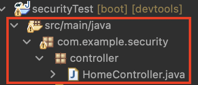
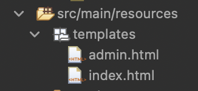
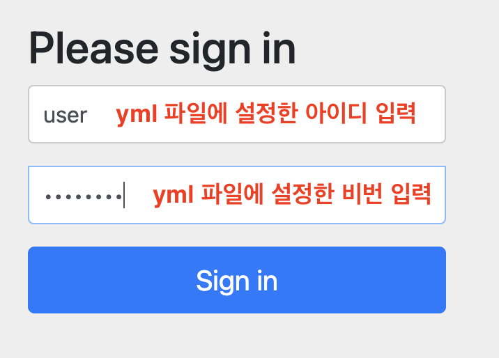

# Spring Security
- Spring Boot의 하위 프레임워크이며 Java 어플리케이션에 인증과 권한 부여를 제공하는데 중점을 둔 프레임워크이다.
- Spring에서는 사실상 Spring Security를 표준으로 하여 보안기능을 제공하며 필터기반으로 처리한다.
- 사용자의 ID와 PassWord를 입력받아 인증하고 역할 및 권한을 부여할 수 있으며
- CSRF(Cross Site Script Forgery)같은 취약점에도 대응이 가능하다.
#### CSRF
- 사용자(희생자)가 자신의 의지와는 무관하게 공격자가 의도한 행위를 웹사이트에 요청하도록 만드는 공격
- 예를 들어 페이스북에 희생자 계정으로 광고성 글을 올려버리는것

## Spring Security 주요 컴포넌트
### Filter
- 톰캣과 같은 웹 컨테이너에서 관리되는 서블릿의 기술이다.
- Client는 Application으로 요청을 전송하고, 컨테이너는 Servlet과 여러 Filter로 구성된 FilterChain을 만들어 요청 URL path 기반으로 HttpServletRequest를 처리한다.
- SpringMVC어플리케이션에서의 Servlet은 DispatcherServlet이다.


### SecurityFilterChain
- Spring의 보안 Filter를 결정하는데 사용되는 Filter이다.
- session, jwt 등 인증 방식을 사용할 때 필요한 설정을 서비스 로직 구현으로부터 분리할 수 있는 환경을 제공한다.
- SecurityFilterChain에는 여러 개의 Security Filter들이 있는데 대표적으로UsernamePasswrodAuthenticationFilter를 살펴보자

### UsernamePasswrodAuthenticationFilter
- Http요청에서 사용자 이름/비밀번호를 추출하여 인증객체를 준비한다.
- 인증은 Spring Security Framework 내에서 인증된 사용자 정보를 저장하는 핵심 표준입니다.
- 인증이 필요한 URL 요청이 들어왔을 때 인증이 되지 않았다면 로그인 페이지를 반환한다.

### SecurityContextHolder
- SecurityContextHolder : Spring Security로 인증한 사용자의 상세 정보를 저장한다.
- SecurityContext : SecurityContextHolder로 접근할 수 있으며, Authentication 객체를 갖는다.

### Authentication
- 현재 인증된 사용자를 나타내며, SecurityContext 에서 가져올 수 있다.
- principal : 사용자를 식별한다. username/password 방식으로 인증할 때 보통 UserDetails 인스턴스다.
- credentials : 주로 비밀번호 정보이다. 대부분 사용자 인증에 사용한 다음 비운다.
- authorities : 사용자에게 부여한 권한을 GrantedAuthority 로 추상화하여 사용한다.

### UserDetailService
- username/password 인증방식을 사용할 때, 사용자를 조회하고 검증한 후 UserDetails를 반환한다.
- 커스텀하여 Bean으로 등록 후 사용할 수 있다.

### UserDetails
- 검증된 UserDetails는 UsernamePasswordAuthenticationToken 타입의 Authentication 을 만들 때 사용된다.
- 이 인증 객체는 SecurityContextHolder 에 세팅된다.
- 커스텀하여 사용할 수 있다.

## Ex_날짜_SpringSecurity 프로젝트 생성하기


### 프로젝트 실행해보기
- 프로젝트 생성후 서버를 구동해서 들어가보면 우리가 만든 페이지는 없지만
- Spring Security에서 제공하는 Login페이지가 나온다.
- Spring Security는 설정하지 않으면 기본적으로 모든 페이지에 권한을 체크한다.


### application.yml 파일 생성하기
- id,password,권한을 정의해보자.
```xml
#Spring Security 설정
spring:
  security:
    user:
      name: user
      password: password
      roles:
      - USER
```

### HomeContorller 생성하기
- com.korea.security.controller 패키지 생성하고 클래스 만들기



```java
package com.example.security.controller;
import org.springframework.stereotype.Controller;
import org.springframework.web.bind.annotation.GetMapping;

@Controller
public class HomeController {

    @GetMapping("/")
    public String home() {
        return "index";
    }

    @GetMapping("/admin")
    public String admin() {
        return "admin";
    }
}
```

### templates에 html파일 생성하기


- index.html

```html
<!DOCTYPE html>
<html lang="en">
<head>
    <meta charset="UTF-8">
    <title>Spring Security Demo</title>
</head>
<body>
    <h1>Welcome to the Home Page!</h1>
    <p>You have successfully logged in.</p>
</body>
</html>
```
- admin.html

```html
<!DOCTYPE html>
<html lang="en">
<head>
    <meta charset="UTF-8">
    <title>Spring Security Demo - Admin</title>
</head>
<body>
    <h1>Welcome to the Admin Page!</h1>
    <p>You have successfully logged in as an admin.</p>
</body>
</html>
```
### Security 설정 클래스 생성
- src/main/java 패키지에 SecurityConfig.java 클래스 생성하기

#### SecurityConfig메서드
- 필터체인을 등록하기 위한 filterChain(HttpSecurity http) 메서드를 보면 매개변수에 여러 메서드를 달아서 최종적으로 build한 것을 리턴한다.
- HttpSecurity를 build하기 전에 해주는 다양한 메서드에 대해서 알아보자.

#### csrf()
- csrf공격에 대한 설정을 하는 메서드
- session을 사용하지 않는다면 csrf에 대해 안전하기 때문에 보통은 disable을 해둔다.
```java
.csrf((csrf) -> csrf.disable());
```

#### authorizeHttpRequests()
- http요청에 대한 인증을 주로 다룬다.
```java
.authorizeHttpRequests((httpRequest) -> {
		httpRequest.requestMatchers("somePath").authenticated();

		httpRequest.requestMatchers("somePath").hasAnyRole("ADMIN", "MANAGER");

		httpRequest.requestMatchers("somePath").hasRole("ADMIN");

		httpRequest.anyRequest().permitAll();
})
```
  - .requestMatchers(String) : 매개변수로 path를 넣어준다. 해당 경로에 대한 요청에 대해서 다룬다.
  - .authenticated() : 일단 인증만 되어있으면 해당 path 요청을 마음대로 할 수 있다.
  - .hasAnyRole(String, String...) : 매개변수로 권한이름을 넣어준다. 갯수는 상관없다. 해당 권한들 중 하나라도 가진 사람들만 이 요청을 할 수 있다.
    - 보통은 ROLEADMIN 이런식으로 권한을 나눠주는데, Spring Security에서 이 메서드를 사용하면 자동으로 매개변수의 앞에 ‘ROLE’ 키워드를 붙여준다. 때문에 앞에 ‘ROLE_’을 붙이면 안 된다.
  - .hasRole(String) : 매개변수로 권한이름을 넣어준다. 딱 하나만 적는다. 해당 권한을 가지고 있는 사람들만 이 요청을 할 수 있다.
  - .anyRequest() : requestMatchers()에 적힌 path들을 제외하고 나머지 모든 경로에 대해서 다룬다.
    - .permitAll() : 아무런 권한이 없어도 전부 요청을 사용할 수 있다.

```java
package com.example.security;

import org.springframework.beans.factory.annotation.Autowired;
import org.springframework.context.annotation.Bean;
import org.springframework.context.annotation.Configuration;
import org.springframework.security.config.Customizer;
import org.springframework.security.config.annotation.authentication.builders.AuthenticationManagerBuilder;
import org.springframework.security.config.annotation.web.builders.HttpSecurity;
import org.springframework.security.config.annotation.web.configuration.EnableWebSecurity;
import org.springframework.security.web.SecurityFilterChain;

@Configuration
@EnableWebSecurity
public class SecurityConfig {

    @Bean
    protected SecurityFilterChain configure(HttpSecurity http) throws Exception {

        //.csrf((csrf) -> csrf.disable())
        //csrf 공격에 대한 옵션은 꺼둔다.
        http.csrf((csrf) -> csrf.disable())

                //특정 URL에 대한 권한 설정
                .authorizeHttpRequests((requests) -> requests
                        .requestMatchers("/admin").hasRole("ADMIN")
                        .anyRequest().authenticated())

                //권한이 필요한 요청은 해당 url로 리다이렉트
                .formLogin(Customizer.withDefaults());
        		
       return http.build();
    }

    @Autowired
    public void configureGlobal(AuthenticationManagerBuilder auth) throws Exception {
        auth
            .inMemoryAuthentication()
                .withUser("user").password("{noop}password").roles("USER")
                .and()
                .withUser("admin").password("{noop}password").roles("ADMIN");
    }
}

```

### 실행하여 결과 확인하기



- 우리가 설정한 아이디와 패스워드로 로그인을 하면 index.html로 이동하게 된다

