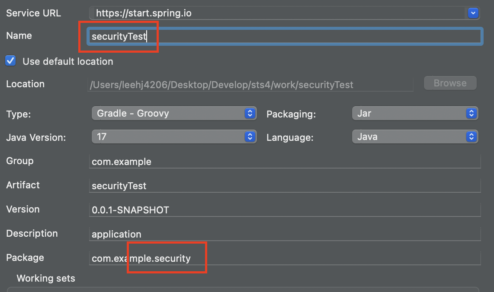
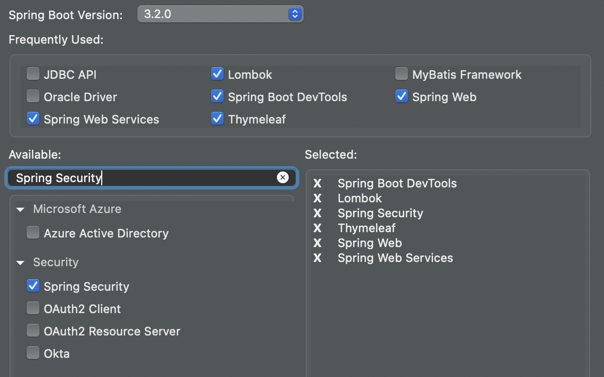

# Spring Security
- Spring Boot의 하위 프레임워크이며 Java 어플리케이션에 인증과 권한 부여를 제공하는데 중점을 둔 프레임워크이다.
- Spring에서는 사실상 Spring Security를 표준으로 하여 보안기능을 제공하며 필터기반으로 처리한다.
- 사용자의 ID와 PassWord를 입력받아 인증하고 역할 및 권한을 부여할 수 있으며
- CSRF(Cross Site Script Forgery)같은 취약점에도 대응이 가능하다.
#### CSRF
- 사용자(희생자)가 자신의 의지와는 무관하게 공격자가 의도한 행위를 웹사이트에 요청하도록 만드는 공격
- 예를 들어 페이스북에 희생자 계정으로 광고성 글을 올려버리는것

## Spring Security 주요 컴포넌트
### Filter
- 톰캣과 같은 웹 컨테이너에서 관리되는 서블릿의 기술이다.
- Client 요총이 전달되기 전후의 URL 패턴에 맞는 요청에 필터링을 해준다.
- Spring Security는 요청이 들어오면 Filter를 chain 형태로 묶어놓는 형태인 Servlet FilterChain을 자동으로 구성한 후 거치게 한다.

### SecurityFilterChain
- Spring의 보안 Filter를 결정하는데 사용되는 Filter이다.
- session, jwt 등 인증 방식을 사용할 때 필요한 설정을 서비스 로직 구현으로부터 분리할 수 있는 환경을 제공한다.
- SecurityFilterChain에는 여러 개의 Security Filter들이 있는데 대표적으로UsernamePasswrodAuthenticationFilter를 살펴보자

### UsernamePasswrodAuthenticationFilter
- Form Login 기반에서 Username과 Password를 확인하여 인증한다.
- 인증이 필요한 URL 요청이 들어왔을 때 인증이 되지 않았다면 로그인 페이지를 반환한다.

### SecurityContextHolder
- SecurityContextHolder : Spring Security로 인증한 사용자의 상세 정보를 저장한다.
- SecurityContext : SecurityContextHolder로 접근할 수 있으며, Authentication 객체를 갖는다.

### Authentication
- 현재 인증된 사용자를 나타내며, SecurityContext 에서 가져올 수 있다.
- principal : 사용자를 식별한다. username/password 방식으로 인증할 때 보통 UserDetails 인스턴스다.
- credentials : 주로 비밀번호 정보이다. 대부분 사용자 인증에 사용한 다음 비운다.
- authorities : 사용자에게 부여한 권한을 GrantedAuthority 로 추상화하여 사용한다.

### UserDetailService
- username/password 인증방식을 사용할 때, 사용자를 조회하고 검증한 후 UserDetails를 반환한다.
- 커스텀하여 Bean으로 등록 후 사용할 수 있다.

### UserDetails
- 검증된 UserDetails는 UsernamePasswordAuthenticationToken 타입의 Authentication 을 만들 때 사용된다.
- 이 인증 객체는 SecurityContextHolder 에 세팅된다.
- 커스텀하여 사용할 수 있다.

## Ex_날짜_SpringSecurity 프로젝트 생성하기

### 프로젝트 실행해보기
- 프로젝트 생성후 서버를 구동해서 들어가보면 우리가 만든 페이지는 없지만
- Spring Security에서 제공하는 Login페이지가 나온다.
- Spring Security는 설정하지 않으면 기본적으로 모든 페이지에 권한을 체크한다.

